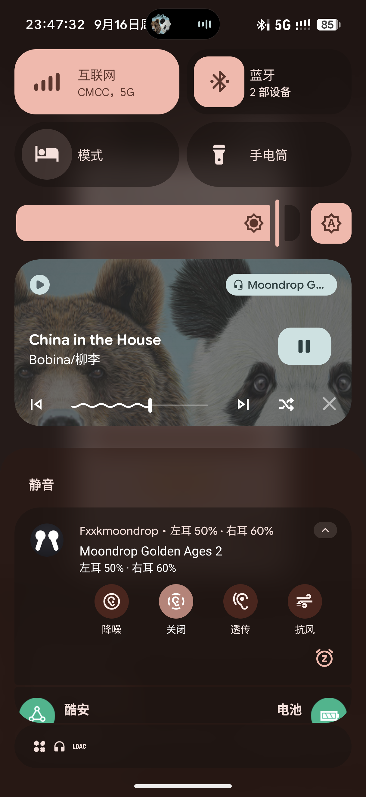
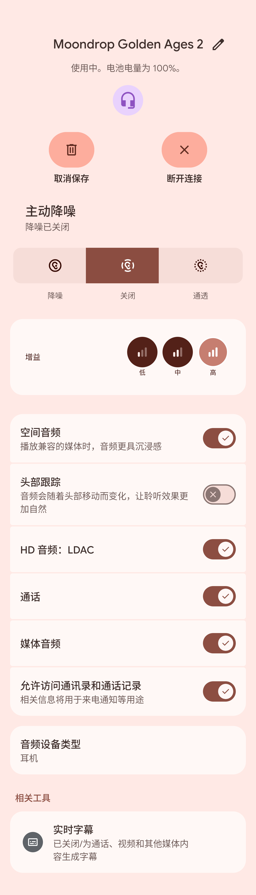

# FxxkMoondrop


> **语言 / Language**：[English](README.en.md) ｜ [简体中文](README.md)

> 作者：[bqj6666](https://github.com/bqj6666) ｜ 版本：**3.2.1**（versionCode 321） ｜ 许可证：**GPL-3.0**（见 [LICENSE](LICENSE)）

> [](https://github.com/bqj6666/FxxkMoondrop/releases/latest) ｜ [更新日志](CHANGELOG.md)

Moondrop 蓝牙耳机助手：耳机连接时自动弹出 **Fast Pair 卡片**，并通过 **GAIA BLE 协议直连**耳机读取状态、控制降噪。项目本体是一个 **LSPosed / Xposed 模块**。

> **AI vibe coding声明**：本项目应用代码**部分使用 AI 辅助生成**，代码已经开发者人工审查与实机验证，但仍可能存在逻辑错误、安全缺陷或兼容性问题。**请仔细核对代码后再使用**，使用风险自负。
>
> **逆向声明**：本项目借助利用 Moondrop App（`com.moondroplab.moondrop.moondrop_app`）的私有接口实现耳机控制与状态读取，**仅供学习研究使用**。项目**不包含 Moondrop App 的任何代码、资源或反编译产物**；所有 hook 目标类名仅以字符串形式引用。请勿用于商业用途，使用后果自负。

---

## 功能

- **蓝牙监听 + GAIA 直连**：BLE GATT 直连耳机，读取左右耳电量，控制降噪
- **ANC 型号档案库**：`AncProfileLib` 按设备名自动套用实测设备码映射（如 GA2 实测 1=关/2=降/3=抗风/4=透传），未实测型号回退默认映射；设置页可自定义映射优先生效
- **FastPairHook（LSPosed 模块，注入 Google Play 服务）**：借道 GMS 的 BLE 扫描能力动态发现耳机 LE 地址并推送给应用
- **自愈闭环**：无缓存 → REQ 扫描 → GMS 推送 → 连接成功写回文件 / SP → 下次秒连；地址变化自动重新发现（**地址全动态发现**）
- **弹窗模式**：Google Fast Pair 半屏弹窗（注入 GMS 的 HalfSheetActivity）；弹窗「设置」按钮跳转系统蓝牙设备详情页
- **系统设置蓝牙详情注入（LSPosed）**：Hook `com.android.settings` 的蓝牙设备详情页（`BluetoothDeviceDetailsFragment`），注入降噪与功能控制面板（抗风 / 增益 / 指示灯），靠近设置界面即点即调；未连接时整块收起，连上但耳机未就绪时用官方加载行原位占位
- **Google 官方耳机控制面板桥接（LSPosed，注入 Google Play 服务）**：Hook GMS 的 Hearable Controls 链路（GFPS 消息组 `0x08`）—— 以 DexKit 特征定位官方 ANC 子模块、放开 Fast Pair 缓存门禁，在**意图入口**与**管理器发送出口**两处接住面板上的点击（降噪 / 通透 / 音量条 / 提示音和振动），翻译成 GAIA 请求交给应用真实下发给耳机；并把应用侧真实档位注入官方 DataStore，官方界面高亮与实际状态保持一致。无 Root 模式下该项注入停用
- **官方空间音频 / 头部跟踪两行（LSPosed）**：详情页直接使用系统自带的「空间音频」与「头部跟踪」两个开关，不再自绘控件 —— 官方那两行在本机被系统判定为不可用并自行移除，模块放开该判定后交由官方渲染，勾选态与点击接到耳机端（GAIA）；仅对本模块支持的耳机接管，他牌耳机（含系统原生支持空间音频者）原样交还官方
- **扩展设备控制（DC）**：空间音频 / 头部追踪 / 增益 / 指示灯控制；三档追踪档位由 `AncProfileLib` 统一换算 —— 空间音频开着时不会停在「关闭追踪」，读到 0 档自动补为 30°，用户在软件内明确关过则尊重其选择。设备码映射由 `AncProfileLib.DcProfile` 按型号提供
- **三协议自动识别**：GAIA V3（BLE）/ GAIA V4（RFCOMM/SPP，布丁）/ Moondrop 私有 9ECA0000 自动路由；dual-mode 设备 BLE 失败回退 RFCOMM/SPP
- **9ECA 私有协议客户端**：音源切换 / EQ / MIC / SN（复用同一 GATT 连接，与 GAIA 并存）
- **设备通知**：耳机电量与降噪控制合并为**一条**常驻通知（只显示左右耳，不含充电盒）；档位按钮带大图标、当前档位实心高亮，颜色随系统动态取色；按钮按设备**实际支持的能力**生成
- **无 Root 模式**：未检测到 Root 时自动回落为**仅通过通知栏与 App 主界面控制降噪**（GAIA BLE 直连本就不需要 Root）；所有 Root 依赖项静默停用，不报错、不弹窗
- **M3 界面**：主页（英雄卡 + 状态面板 + 降噪三按钮）、设置页（外观 / 功能 / 自定义映射 / 后台 / 诊断，随系统深浅色 + Material You 动态取色）、关于页，全部使用 Material 3 组件
- **权限检测**（整页二级界面）：6 项实时检查，按**必要权限**（蓝牙 / 通知 / GAIA 直连）与**可选权限**（电池白名单 / Root / FastPairHook 模块）分组呈现，缺失一键跳转修复；结论只看必要项，可选项缺失不算「权限没配好」
- **日志抓取**（设备适配）：一键收集系统信息 / 应用设置 / 蓝牙 / 运行环境 / logcat 六类日志打包为 ZIP
- **保活默认常开且无需 Root**：开机自启 + 30 秒看门狗 + 系统电池优化白名单（只主动询问一次）；设备已 Root 时静默追加 `deviceidle` / `appops` 增强，失败不影响使用。另有后台隐藏可选开关
- **使用引导**：首次启动自动展示，横滑分页、每页一个功能分区 —— 关于 / 权限申请 / 连接管理 / 系统集成 / 耳机控制 / 适配与诊断 / 欢迎使用；页内开关与设置页同源，改完立即生效。看完或跳过后不再自动弹出，设置页最底部可随时重看
- **显示层中英文切换**：语言偏好（跟随系统 / 中文 / English），主界面三 Tab、设置项、降噪面板、日志弹窗、检查权限页文案随语言切换；通过 exported ContentProvider 供 GMS 弹窗跨进程读取

## 软件截图

| 主页概览 | 设置 | 关于 | Fast Pair 弹窗 | 设备通知 | 设备详情 |
|---|---|---|---|---|---|
|  |  |  |  |  |  |

## 技术栈

| 项目 | 说明 |
|---|---|
| 语言 | **Kotlin** |
| 构建链 | Gradle 8.9（wrapper 固定）+ AGP 8.5.2 + Kotlin 1.9.22 |
| UI | Material 3,`Theme.Material3.DayNight.NoActionBar`+ 动态取色，三页 Fragment 架构 |
| 最低系统 | **Android 8.0**（API 26）；targetSdk 36 |
| 模块 | libxposed API 102（LSPosed ≥ 2.1.1，作用域 `com.google.android.gms;com.android.settings`） |
| 包名 | `com.fxxkmoondrop.secret` |

## 构建

```bash
./gradlew :app:assembleRelease -PfxxkKeypass=<签名密码>
```

- 产物：`app/build/outputs/apk/release/app-release.apk`
- Gradle `packaging.merges` 自动合并 `META-INF/xposed/*`（`java_init.list` / `module.prop` / `scope.list`），构建后自动签名
- 签名密钥自备，构建时通过 `-PfxxkKeypass=` 传入密码

## 安装

1. 安装 APK
2. 在 **LSPosed** 中启用并勾选作用域 `com.google.android.gms`（可选 `com.android.settings`）
3. 首次启动会展示**使用引导**，可在其中直接完成权限授权（设置页「检查权限」亦可一键跳转修复）；已跳过的话可在设置页最底部重新打开
4. **Root 可选**：没有 Root 也能用 —— 未检测到 Root 时自动进入无 Root 模式，照常读电量、切降噪（走 GAIA BLE 直连），仅官方面板注入、弹窗图标自定义、Root 保活等增强项停用。机制详见 [ARCHITECTURE.md](ARCHITECTURE.md) 的「无 Root 模式」

> ##  需要更多耳机实机测试;
>
> 下表**理论支持**与**未知**的型号多为芯片级推断，尚未逐一实机验证。欢迎拥有对应耳机的用户可以帮忙**连接一次并把结果反馈到 [Issue](https://github.com/bqj6666/FxxkMoondrop/issues)**

## 支持设备

> 兼容性判定基于**蓝牙传输层与服务指纹**，不依赖型号名：
> - 耳机暴露高通 **GAIA 服务** via BLE GATT → 走 GAIA V3 协议
> - 耳机暴露高通 **GAIA 服务** via Classic BT RFCOMM/SPP → 走 GAIA V4 协议（如布丁 PUDDING）
> - 耳机暴露 Moondrop 私有 **`9ECA0000` 服务** → 走私有协议（音源切换 / EQ / MIC / SN）
>
> 因此只要主控为**高通 QCC** 或**中科蓝讯（Bluetrum）**，理论上即可接入。

| 状态 | 耳机型号 | 主控 / 协议 | 依据 |
|---|---|---|---|
| 支持 | 梦回2 / Golden Ages 2（GA2） | TWS-01 定制 SoC（GAIA） | 实机验证通过（ANC 设备码 1=关/2=降/3=抗风/4=透传 已入库） |
| 理论上支持 | 爱丽丝 ALICE | QCC5151（GAIA） | 芯片理论支持 |
| 理论上支持 | 火花 SPARKS | QCC3040（GAIA） | 芯片理论支持 |
| 理论上支持 | 旅行者 VOYAGER（颈挂） | QCC5144（GAIA） | 芯片理论支持 |
| 支持 | 梦回1979 / Golden Ages | 与梦回2同平台同款主控（GAIA） | 芯片理论支持 |
| 理论上支持 | 猫饼 NEKOCAKE | BT8922E（9ECA） | 芯片理论支持 |
| 支持 | 太空漫游2 / Space Travel 2 | BT8932F（9ECA） | 实机验证通过（ANC 设备码 1=关/2=降/3=抗风/4=透传；增益 设备码 0=高/1=中/2=低 已入库） |
| 理论上支持 | 音乐胶囊 PILL | BT8932F（9ECA） | 芯片理论支持 |
| 理论上支持 | 超声波 ULTRASONIC | BT8952F（9ECA） | 芯片理论支持 |
| 应当支持 | 知更鸟 Robin | BT8952F（9ECA） | 芯片理论支持 |
| 应当支持 | 太空漫游 / Space Travel（一代） | 疑似中科蓝讯（型号未确认） | 待实机验证 |
| 未知 | 猫咖 MOCA | 疑似蓝讯（蓝牙 5.4 / LC3 特征） | 待实机验证 |
| 未知 | 方糖 BLOCK | 疑似蓝讯 BT8922 系 | 待实机验证 |
| 应当支持 | 布丁 PUDDING（MD-TWS-056） | 国产 SoC（GAIA V4，RFCOMM/SPP） | 借助 [PuddingPods](https://github.com/lingbai-rong/PuddingPods) 项目协议文档完成适配，5 档 ANC + 三路电量 + 增益 + 指示灯 |
| 支持 | 太空漫游2 ULTRA | 国产 SoC（型号未公开） | 已实机验证 |
| 未知 | 羽翼 EDGE / EDGE2 | 国产 SoC（型号未公开） | 待实机验证 |

- **支持**：开发者实机验证过
- **理论上支持（应当支持）**：主控芯片已确认且协议侧能自动识别，但尚未逐一实机跑通
- **未知**：主控未公开或被疑为蓝讯系，需连接耳机后看日志 GATT 指纹（`GAIA` / `9ECA0000`）定论

---

## Google Fast Pair Service 弹窗适配

> **Fast Pair 弹窗依赖完整的 Google Play 服务（GMS）**，能否弹出与**手机系统的 GMS 完整程度**有关，与耳机型号无关。模块自身无需单独安装 GMS 组件。

| 系统 | Fast Pair 弹窗 | 说明 |
|---|---|---|
| 支持 | 类原生 / 原生系统（需完整 GMS） | 功能完全正常 |
| 需额外模块 | ColorOS（OPPO / realme / 一加） | 需搭配 [oplus-cn2global（Magisk 模块）](https://github.com/AndroPlus-org/magisk-module-oplus-cn2global) + [Luckytool（Xposed，解除 GMS 限制）](https://github.com/Xposed-Modules-Repo/com.luckyzyx.luckytool) 后 Fast Pair 弹窗才可用 |
| 待实测 | 其他系统 | 只要是支持完整 GMS 的系统，理论上均支持（尚未逐一实机验证） |

### 启用作用域与 Hook 覆盖

模块的 LSPosed **启用作用域只需两项**：`com.android.settings` 与 `com.google.android.gms`。

| Hook 目标 | 所在作用域 | 状态 |
|---|---|---|
| 设置页入口 | `com.android.settings` | 启用 |
| 蓝牙设备详情面板 | `com.android.settings` | 启用 |
| Fast Pair 弹窗（卡片 \/ 连接态） | `com.google.android.gms` | 启用 |

源码中另保留两条链——`hookMoondrop`（官方水月雨 App 的 GAIA 命令通道）与 `hookBluetooth`（`com.android.bluetooth`：A2DP 状态变化 → `BT_EVENT` 广播，用于识别耳机接入）：

- **当前不在启用作用域内，因此不会执行**；
- **代码完整保留、未被删除**，以备后续多设备适配时启用；
- 模块**不 hook 官方水月雨 App**（避免与其自身逻辑冲突）。

> Fast Pair 弹窗的混淆类名（`dtes` \/ `dthi` \/ `dtok`）随上游重编译可能改名，已由 DexKit 特征定位自动兜底（详见版本历史 2.50）；仅当原类名加载失败时才启用，失败仍回退原类名，**不影响上述任何行为**。

---

## 目录结构

```
FxxkMoondrop-repo/
├── app/                  # Gradle 应用模块（sourceSets 指向 ../src）
│   └── src/main/         # res / AndroidManifest.xml / resources/META-INF/xposed
├── src/                  # 全部 Kotlin 源码（com.fxxkmoondrop.secret）
├── screenshots/          # README 用到的界面截图
├── gradle/               # Gradle wrapper（8.9）
├── build.gradle.kts      # AGP 8.5.2 + Kotlin 1.9.22（apply false）
├── settings.gradle.kts   # 模块声明与仓库
├── tools/                # 构建辅助脚本（post_edf.py：EDF 注入 + 重签）
├── ADAPTATION.md         # 设备适配说明（协议知识 / 踩坑 / 实测数据）
├── ARCHITECTURE.md       # 系统架构文档（进程模型 / 数据流 / 弹窗布局 / 协议）
├── DEVELOPMENT.md        # 开发文档（构建环境 / 目录 / 版本规范 / 调试 / 发布清单）
├── CHANGELOG.md          # 更新日志（按版本号逐条记录）
└── (无需 xposed-api-stub.jar)  # 已改用 Maven 依赖 io.github.libxposed:api:102.0.0
```

## 开发文档

项目在仓库根目录维护了多份开发文档，建议按需阅读：

| 文档 | 内容 | 适用场景 |
|---|---|---|
| [ADAPTATION.md](ADAPTATION.md) | 设备适配说明：协议知识、踩坑经验、实测数据、BLE/9ECA 帧格式、ANC 设备码映射、连接策略 | 新增耳机适配、排查连接/协议问题时阅读 |
| [ARCHITECTURE.md](ARCHITECTURE.md) | 系统架构：双进程模型、跨进程通信、核心模块、关键数据流、弹窗布局、协议架构与设计原则 | 理解项目整体设计、做较大改动前阅读 |
| [DEVELOPMENT.md](DEVELOPMENT.md) | 开发指南：构建环境与命令、签名与 EDF 作用域注入、目录结构、版本号规范、LSPosed 元信息、依赖清单、调试技巧、发布检查清单 | 本地编译、二次开发、提 MR 前检查 |
| [CHANGELOG.md](CHANGELOG.md) | 更新日志：按版本号逐条记录（3.0 起为正式版号，此前为 `alpha.x.y`）的功能、修复与逆向进度 | 查看版本演进历史 |

> 版本号格式：**3.0 起为正式版** `主版本.次版本`；此前为 `alpha.x.y`（`x` 里程碑、`y` 迭代）。`versionCode` 单调递增。详见 [DEVELOPMENT.md 版本号规范](DEVELOPMENT.md#版本号规范)。

## 致谢

- [JingMatrix](https://github.com/JingMatrix) 及其维护的 [LSPosed](https://github.com/JingMatrix/LSPosed) / [Vector](https://github.com/JingMatrix/Vector) 框架：本项目的**界面与交互风格参考了 LSPosed Manager 的设计**，特此致谢；项目亦受益于 LSPosed 生态的工具链
- [LSPlant](https://github.com/JingMatrix/LSPlant) 与 Xposed / LSPosed 社区
- [lingbai-rong/PuddingPods](https://github.com/lingbai-rong/PuddingPods)：通过该项目的协议逆向文档，FxxkMoondrop 完成了对水月雨布丁 PUDDING（MD-TWS-056）的适配——包括 GAIA v4 over RFCOMM/SPP 连接方式、5 档 ANC 设备码映射、三路电量（含充电盒）读取、增益与指示灯控制协议
- 各AI 协助进行开发

## 版本历史

- **3.2.1**：**弹窗不再误伤其他 Fast Pair 耳机**。Google 给 Pixel Buds / Sony / Nothing 这类真正支持 Fast Pair 的耳机弹的原生卡片，用的是与模块自绘弹窗**同一个** `HalfSheetActivity`，此前只认类名就动手，会在别人的卡片上覆盖图标与电量、塞进降噪按钮，甚至**吞掉人家的「连接」按钮**。现在加了弹窗归属判定（自绘弹窗先登记启动时刻再认领实例，非本模块的卡片一律不介入），并按卡片设备名二次校验。**多设备修复**：GAIA 链路空闲但仍残留上一次的设备地址时，改为连接本次检测到的耳机（此前永远重连旧地址，换耳机时新的连不上）；断开某一副时只断我们正连的那一副（此前一副断开会把另一副一起掐掉）；同时连多副时的处理顺序改为确定序。
- **3.2.0**：**空间音频与头部跟踪改用系统蓝牙详情页里官方自带的那两行开关**（原自绘控件删除）—— 官方 controller 在本机恒判不可用并自行移除那两行，模块放开判定后交还官方渲染，勾选态与点击接到耳机端；仅对本模块支持的耳机接管，他牌耳机原样交还官方（按设备地址判定，不再误伤系统原生支持空间音频的耳机）。修复**打开空间音频后追踪档位停在「关闭」**：确立「空间音频开着时不会是关闭追踪」的不变量，读到 0 档自动补为 30°，用户手动关过则不再补。**降噪按钮顺序在主界面 / 通知栏 / Google 弹窗三处统一**为「降噪 / 关闭 / 通透 / 自适应 / 直播 / 抗风」。新增**使用引导**（7 页横滑，首启自动展示、设置页最底部可重看）。权限检测与引导权限页按**必要 / 可选**分组，结论只看必要项。
- **3.1.0**：蓝牙设备详情页大改 —— 把官方自己的行放出来（HD 音频 / 通话 / 媒体音频等），我们的面板与官方降噪切片各归其位；面板跟着连接状态显隐（未连接整块收起，未就绪时用官方加载行原位占位）。修复「相关工具」下方一大片空白与面板重复渲染（详情页行视图被适配器回收导致残留，改为重排后重新布局而非 `notifyDataSetChanged`）；把我们的行统一摘到屏幕根下并按其 order 定序，位置不再漂移；抗风改为与官方同款开关（仅在降噪 / 抗风档出现）。
- **3.0.5**：**保活改为「无需 Root、默认常开」**，移除设置里的「Root 强力保活」开关（无 root 走开机自启 + 看门狗 + 电池优化白名单，有 root 静默追加增强）；修复「没 root 就被整片禁用」—— 依赖 LSPosed 模块的功能不再看 root；「模块激活」与「有 root」不再混为一谈；root 探测失败不再永久缓存（未授权时 root 会整体隐藏，只能重试、不能当结论），权限检查新增「重新检测 Root」入口；修复弹窗自定义图标「选了没反应」。
- **3.0.4**：Root 检测不再只认 `su`（认 kp / APatch / FolkPatch 系），Root 命令执行去掉硬编码 `su`。
- **3.0.3**：能力响应改按「特征对列表」解析，ANC 路径不再被误判为未知；修正布丁 ANC_V2 档位映射；自适应档位在所有界面统一可用；Hook 返回值类型安全化（防宿主进程崩溃）；界面版本号去掉 "Alpha" 字样。
- **3.0.2**：修复 RFCOMM 发送缺少 GAIA 传输帧封装。
- **3.0.1**：协议指纹证伪之前不拉黑设备。
- **3.0**：新增无 Root 模式 —— 未检测到 Root 时自动回落为仅通过通知栏与 App 主界面控制降噪（GAIA 直连本就不需要 Root），所有 Root 依赖项静默停用且不报错、不弹窗；设备常驻通知合并为一条（电量 + 降噪档位按钮，大图标 + M3 动态取色，按设备能力动态生成档位）；修复官方降噪面板点击无反应（点击走管理器发送出口，原 hook 的两条路径都到不了，且发包被「等上一次 SET 响应」永久挡住）；设置页新增官方集成 / 通知四类功能开关，并按功能域重组为外观 / 功能 / 自定义映射 / 后台 / 诊断；**权限收紧**：移除从未使用的 `SYSTEM_ALERT_WINDOW`（本模块不创建悬浮窗）与 `FOREGROUND_SERVICE` / `FOREGROUND_SERVICE_CONNECTED_DEVICE`（该服务从不调用 `startForeground()`，实为普通后台服务），清单只剩真正在用的权限。
- **alpha2.54**：修复反复开关「动态取色 / AMOLED 纯黑」导致崩溃。根因是主题开关在延迟回调里直接 `requireActivity().recreate()`，既无取消机制（连点会排队多个重建），闭包又持有已 detach 的 Fragment 实例，后一个回调必抛 `Fragment not attached to an activity`。现改为统一入口 `scheduleRebuild()`：先取消再投递、连续请求合并为一次重建，并在执行前三重检查 `isAdded / activity / isFinishing`；`onDestroyView` 一并清理挂起回调。实测 12 次连续点击（296ms 内）只重建 1 次、无异常。
- **alpha2.53**：修复断开连接后英雄卡徽章仍停留在旧编解码器（如 LDAC）。根因是编解码器缓存断开时未清空，且徽章刷新未挂到连接状态广播上。**alpha2.52 因该缺陷已撤回，请使用本版**。
- **alpha2.52**：界面按 Material 3 规范统一重构 —— 大标题随滚动收缩（M3 LargeTopAppBar）、切页 fadeIn + scaleIn 动效、英雄卡改强调色、主题与语言改为「行 + 当前值 + 下拉菜单」（菜单出现在手指落点、选中项强调色 + ✓）。修复蓝牙设备详情注入面板退化为单行条目（hook 进程误用宿主 Context 解析模块资源，双方包 ID 同为 `0x7f`，撞上宿主资源抛异常被吞）；空间音频开关改用设置 App 原版控件（`new MaterialSwitch` 在 Settings 进程必崩）。ANC 四态与弹窗降噪按钮改 Material Symbols 矢量；应用图标重构为自适应图标（background / foreground / monochrome）。英雄卡徽章改显示当前编解码器（LDAC / AAC / SBC 等，经 Root 读取 dumpsys，不维护名称表，读不到退回链路类型）。自定义映射改下拉选择、追踪标签改失焦保存。全仓单测 26 例全绿。
- **alpha2.51**：修复 ANC 按钮映射「透传 ↔ 抗风」互换（issue #1）——根因是设置页编辑任一档位时只写被编辑的那一格，其余格在读取时回退到**名义默认映射**而非该型号**档案映射**；设备码 3/4 在 GA2、太空漫游2 上分别对应「抗风」与「透传」，名义顺序恰好与档案相反，于是动过任意一格即两按钮静默互换。现将回退基准改为型号档案，并新增一次性 `healStaleCustomAncMap()` 自愈存量脏配置（档案与名义顺序一致的型号恒不命中，绝不误清用户设置）；设置页改为**四档全量落库**从源头杜绝，提示文案补当前型号档案名。新增 `AncProfileLibTest` 回归用例，全仓单测 26 例全绿。未触碰连接链、协议识别与 GET/SET 语义。
- **2.50**：引入 DexKit 特征定位——GMS Fast Pair 混淆类名（`dtes`/`dthi`/`dtok`）随上游重编译可能改名，硬编码迟早失效；现新增 `DexKitLocator`，用 dex 内稳定特征串反查，仅当原硬编码类名加载失败时才启用（快路径与改造前逐字等价、零开销），定位失败仍回退硬编码名，**只增强不替代**；`dtok` 无特征串，由 `dtes` 字段 `c` 的类型反推。同时 `abiFilters` 收敛 ABI，APK 减约 0.8MB。实机以假类名强制触发兜底路径验证成功，无任何 hook / 协议 / 设备库行为改动。
- **alpha2.41.10**：监听开关合并——主界面「开始/停止后台监听」按钮移除，统一由设置「后台监听」总开关控制（开启即启动监听并双写 `enable`/`auto_service`，启动应用自动恢复、开机自启、后台防杀随之生效；关闭即停止服务并取消保活）；主界面保留英雄卡运行状态展示。
- **alpha2.41.9**：issue #3 三连修——①后台隐藏误退出（`MainActivity.onStop` 无条件 `finishAndRemoveTask` 改为仅 `onUserLeaveHint` 用户主动离开时隐藏，并用全局可见界面计数 + 延迟复核保护应用内跳转与授权流程）；②GAIA 地址缓存污染（FastPairHook 推送地址按 `DeviceMatcher` 设备名过滤；三处「未验证即落盘」改为只驻内存，仅服务确认后持久化；无 GAIA/9ECA 服务时清坏缓存 + 移出候选自愈）；③后台弹窗随之恢复，设置页「后台隐藏」文案同步澄清。
- **alpha2.41.8**：图标避开电量改为布局完成后轮询定位——等电量 subhead 布局完成再计算 top 偏移，避免偏移取 0 仍被遮挡，并加定位日志。
- **alpha2.41.7**：设备卡图标 top 动态避开电量 subhead，防止图标遮挡电量百分比。
- **alpha2.41.6**：首次关闭弹窗后 GAIA 就绪不再二次弹窗——弹窗关闭时 PopupGate.markUserClosed() 登记设备（本连接断开前不再自动重弹），HalfSheet 关闭广播带设备名并刷新弹窗防重时间戳；断开自动清除登记，不影响下次连接与其他型号回归。
- **alpha2.41.5**：Space Travel 2 映射写库 + 弹窗防重。设备库：Space Travel 2 加入 PROFILES（ANC 映射 `[1,2,4,3]`，与 GOLDEN AGES 2 一致），DcProfile 增益 `gainMap` 修正为 `[2,1,0]`（实测 0x00=高/0x01=中/0x02=低 反向）。弹窗防重：postShow 统一防重（弹窗还开着或距上次显示<12s 不弹新窗），弹窗关闭时 cancelPending() 取消排队——连上只弹一次，等 GAIA 就绪后同一弹窗刷新为可控制，或关闭后改在 App 操作。
- **alpha2.41.4**：RFCOMM 帧切分重构 + 能力探测响应驱动降级——新增 GaiaRfcommFramer 流式状态机，SPP 流按官方 TransportProtocol 精确切帧（FF 帧按 Len 切、裸 PDU 按帧边界切、半截帧跨 burst 保留），修复设备响应双发时粘包错切/乱码；CapabilityProbe 新增 onFeatureResponseSeen/onBasicAlive，不回能力位图的设备靠真实回包驱动能力标记，BASIC cmd0（GET_GAIA_VERSION）一并处理；startProbes 8 秒节流防 RFCOMM 重连风暴探测循环叠加，TX 裸 PDU 路径零改动。
- **alpha2.41.3**：运行时权限申请补 BLUETOOTH_SCAN——申请数组扩为 CONNECT+SCAN（与官方 App 一致），PermissionChecker 同时检测两者；修复 Space Travel 2 等 9ECA BLE 控制设备因缺 SCAN 权限抛 SecurityException、BLE 通道挂掉被迫回退 RFCOMM、GAIA 能力不完整导致降噪/增益无法调节的问题。

- **alpha2.41.2**：连接稳定性增强——MOCA 等 dual-mode 设备 RFCOMM/SPP 兜底。GaiaBleClient 单候选分支做 LE → TRANSPORT_AUTO → RFCOMM 三级升级兜底（默认，所有设备）；LE 与 TRANSPORT_AUTO 均失败（status=147）时主动尝试 RFCOMM/SPP，解决 MOCA（猫咖）等 LEE GATT 被 BR/EDR 挤掉无法建立 GAIA 控制通道的问题；新增 rfcommFallbackTried 标志防止 RFCOMM 失败刷屏；connect() 里 useRfcomm 已连时直接复用，避免 detect 轮询断开 RFCOMM。
- **alpha2.41.1**：修复日志导出 EACCES（Permission denied）——部分 ColorOS 系统上 getExternalFilesDir 返回的 /Android/data/.../files/Download/logs/ 路径在写 ZIP 时被存储策略拦截，日志抓取报「保存失败」；LogCollector 打包目录改为应用内部 filesDir（绝对可写），导出链调整为 Root 复制公共根 → MediaStore 写入系统公共下载（Android 10+ 免存储权限）→ 兜底内部目录，确保日志 ZIP 任何 ROM / 有无 Root 都能保存并分享
- **alpha2.41.0**：蓝讯系连接稳定性修复 + 太空漫游2（Space Travel 2，BT8932F）适配——GaiaBleClient 新增 lastConnectedAddr + transportAutoTried，dual-mode TWS 服务发现阶段被 LE 挤掉（status=147）时 transportFor 回退 TRANSPORT_AUTO，单候选断连记录地址延迟重连；AncProfileLib 新增 SPACE TRAVEL 2 DC 档案（无空间音频、三档增益、恒等映射）
- **alpha2.40.1**：Fast Pair 弹窗「设置」按钮改为跳转系统蓝牙设备详情页（不再跳转软件主界面）；新增 resolveMoondropAddress() 从已配对设备动态匹配 Moondrop 耳机地址（不硬编码 MAC），用 :settings:show_fragment + device_address 打开系统蓝牙设备详情页；匹配不到时兜底回退原 MainActivity
- **alpha2.40.0**：控制面板搬进蓝牙设备详情页——在Settings蓝牙设备详情注入降噪控制 + 功能控制面板；未连接时空间音频开关三重禁用（isEnabled+isClickable+isFocusable）；降噪控制标题 topMargin=dp(16) 不再贴卡片顶边；纯注入UI组件（ControlPanel/DeviceDetailsPanel/CtrlBus），不打BLE/Gaia单例、不动主界面链路
- **alpha2.38.9**：借助 [PuddingPods](https://github.com/lingbai-rong/PuddingPods) 协议文档完成布丁 PUDDING（MD-TWS-056）适配——GAIA v4 over RFCOMM/SPP 连接、5 档 ANC（关闭/自适应/通透/抗风/基础降噪）、三路电量含充电盒、增益与指示灯控制；并修复 SettingsFragment 重复 `setContentView` 导致的弹窗自定义图标闪退
- alpha2.38.7：弹窗电量文字恢复写进 GMS 原生 `subhead`（耳机名下方、图标上方），移除自绘 overlay + 硬编码坐标；仅 subhead 缺失时兜底自绘，位置从 `PopupProfile` 屏幕布局库读取
- alpha2.38.5：修复弹窗电量显示丢失 + ANC 按钮无响应（模式条动态定位追踪 central_btn）
- alpha2.38.4：弹窗图标+模式面板整体上抬 140px，给设置按钮腾出空间
- alpha2.38.3：设置按钮完全克隆确定按钮 + 上方对齐
- alpha2.38.2：新增 `PopupProfile` 数据类 + `PROFILE_61`/`PROFILE_63` 两档配置，按屏幕分辨率自动选档
- alpha2.38：移除 PopupOverlay + 全部硬编码 UI 值修复
- alpha2.37：弹窗设置按钮对齐 + DC 自定义设置
- **alpha2.31**：Xposed 模块迁移至 **libxposed API 102**（适配 LSPosed ≥ 2.1.1）——`XposedEntry` 继承 `XposedModule`，全部 hook 改用 `module.hook().intercept{}`，`HookHelper` 纯反射替代 `XposedHelpers`，资源声明迁移至 `META-INF/xposed/{java_init.list,module.prop,scope.list}`，Maven 依赖替代本地 stub jar
- alpha2.26.10：GET/SET 双向映射分离——GA2 固件读回 0-based 直传（0=关/1=降/2=透/3=抗），与 SET 的 1-based 枚举（1/2/4/3）独立档案映射；修复读回 0 时按钮状态卡死
- **alpha2.26.9**：ANC 型号档案库 `AncProfileLib`——GA2 实测 1=关/2=降噪/3=抗风/4=透传，按设备名自动套用；未实测型号回退默认映射；自定义映射优先生效（仅 GAIA 路径，9ECA 蓝讯系不混用）
- **alpha2.26.8**：连接修复——仅扫描确认的 LE 地址才持久化，连接成功先刷新 GATT 缓存（对齐官方 refreshDeviceCache）
- **alpha2.26.7**：回退 UNKNOWN→AudioCuration 违规链——「未知/未就绪」不再误发跨路径命令
- **alpha2.26.2**：ANC 按钮映射可配置化——设置页自定义设备码（0-5），默认 AC 1-based [1,2,3,4]
- **alpha2.26**：降噪控制重构后按钮错乱修复——`fetchAncMode` 真正改用 `cmd=3(GET_MODE)`，官方面板/主界面补齐第 4 模式「抗风」
- **alpha2.25**：能力探测回退 cmd=41→3——`fetchAncMode` 的 AudioCuration 路径改读 `cmd=3(GET_MODE)`（GA2 对 cmd=41 回包不稳），已装机验证
- **alpha2.24**：官方 App 逆向证据落地——GA2 走 ANC_V2(0x20)，按回包 feature 判定 ANC 路径不硬编码型号
- **alpha2.23**：降噪刷新「跳回关闭」修复——ANC 路径恒等映射 + ancPath 显式化 + 降噪读取改用 cmd=41(GET_CURRENT_ANC_SWITCH_CONF)
- **alpha2.22**：取消乐观更新 + 官方高通协议(AudioCuration)落地——能力位图截断检测、能力探测终态、主动只读探测、ANC 三态广播、cachedLe 绑设备名防串扰
- **alpha2.21**：连接锁到已学习 LE 地址，GA2 开盖 1.8s 秒连不再 12s 超时轮换
- **alpha2.20**：已学习 LE 地址优先于 bonded 主地址，避免拿 PUBLIC 地址走 LE 后台等广播
- **alpha2.19**：修复降噪控制“时好时坏”——能力探测标志永不重置导致 `ancPath` 卡死在 -1，现改为断连与每次新 GATT 会话均重置并超时自愈重发
- **alpha2.18**：修复"耳机已断开仍显示已连接"的假连接问题（陈旧缓存作废 / 双地址自我反馈防护）
- **alpha2.17**：修复 GA2（DUAL）连接不上——按名称扫描真实 LE 地址，实现自愈闭环
- **alpha2.16**：接入 9ECA0000 完整协议客户端（音源切换 / EQ / MIC / SN），全链路运行日志
- **alpha2.15**：跨型号适配 + 官方 App 逆向证据补充
- **alpha2.14**：开源发布（GitHub）基础版
- **alpha2.13**：Kotlin 迁移 28/28 完成（纯 Kotlin 源码）；修复设置 / 关于页标题与状态栏重叠；修复切换 AMOLED 触发 recreate 后页面丢失；Gradle + AGP 工程化完成；clean 全量构建验证通过
- **alpha2.12**：M3 三页 Fragment 架构（主页 / 设置 / 关于）
- **alpha2.0 及以前**：单体 Activity + 旧打包链（历史版本不在本仓库）

<a id="support"></a>

## 赞赏 / Support

如果这个项目帮到了你，欢迎扫码打赏 —— 你的支持是我更新的最大动力。

<p align="center">
  
</p>

## 免责声明

本项目仅供学习与研究 Android 逆向与蓝牙协议使用，请勿用于任何商业用途或侵犯他人权益的行为。使用本项目造成的一切后果由使用者自行承担。
