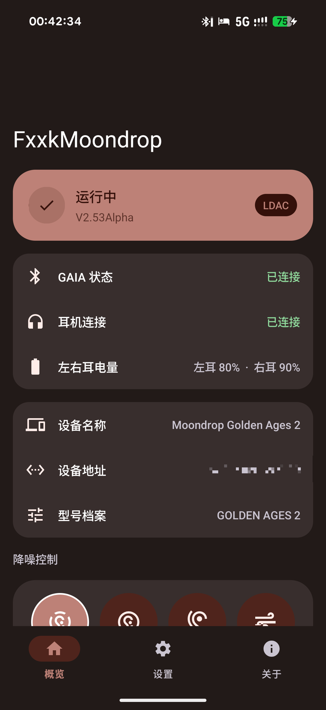
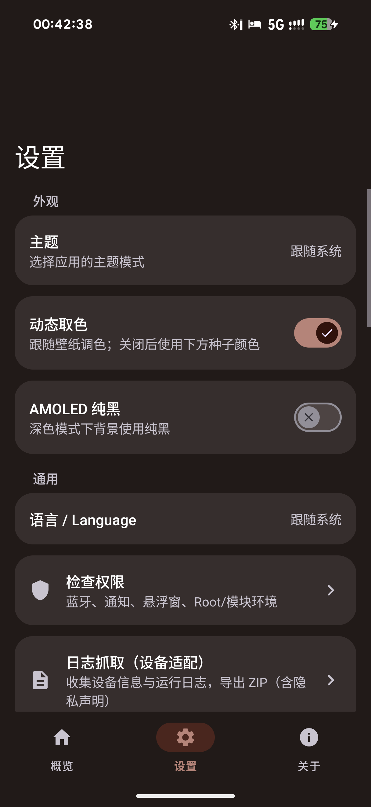
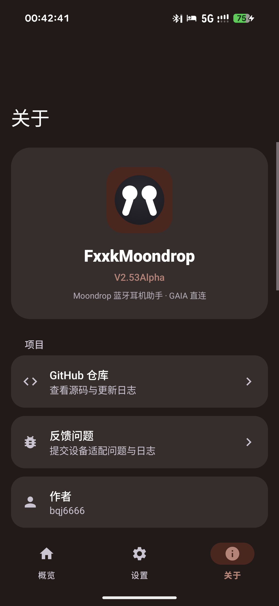
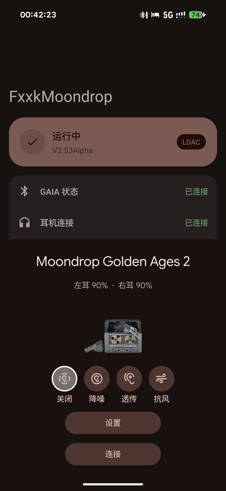

# FxxkMoondrop

> **语言 / Language**：[English](README.en.md) ｜ [简体中文](README.md)

> 作者：[bqj6666](https://github.com/bqj6666) ｜ 版本：**alpha2.40.1**（versionCode 273） ｜ 许可证：**GPL-3.0**（见 [LICENSE](LICENSE)）

Moondrop 蓝牙耳机助手：耳机连接时自动弹出 **Fast Pair 卡片**，并通过 **GAIA BLE 协议直连**耳机读取状态、控制降噪。项目本体是一个 **LSPosed / Xposed 模块**。

> **AI vibe coding声明**：本项目应用代码**部分使用 AI 辅助生成**，代码已经开发者人工审查与实机验证，但仍可能存在逻辑错误、安全缺陷或兼容性问题。**请仔细核对代码后再使用**，使用风险自负。
>
> **逆向声明**：本项目借助利用 Moondrop App（`com.moondroplab.moondrop.moondrop_app`）的私有接口实现耳机控制与状态读取，**仅供学习研究使用**。项目**不包含 Moondrop App 的任何代码、资源或反编译产物**；所有 hook 目标类名仅以字符串形式引用。请勿用于商业用途，使用后果自负。

---

## 功能

- **蓝牙监听 + GAIA 直连**：BLE GATT 直连耳机，读取左右耳电量，控制降噪
- **ANC 型号档案库**：`AncProfileLib` 按设备名自动套用实测设备码映射（如 GA2 实测 1=关/2=降/3=抗风/4=透传），未实测型号回退默认映射；设置页可自定义映射优先生效
- **FastPairHook（LSPosed 模块，注入 Google Play 服务）**：借道 GMS 的 BLE 扫描能力动态发现耳机 LE 地址并推送给应用
- **自愈闭环**：无缓存 → REQ 扫描 → GMS 推送 → 连接成功写回文件 / SP → 下次秒连；地址变化自动重新发现（**地址全动态发现、零硬编码**）
- **弹窗模式**：Google Fast Pair 半屏弹窗（注入 GMS 的 HalfSheetActivity）
- **M3 界面**：主页（英雄卡 + 状态面板 + 降噪三按钮）、设置页（外观 / 通用 / 行为，随系统深浅色 + Material You 动态取色）、关于页，全部使用 Material 3 组件
- **权限检测**（整页二级界面）：蓝牙 / 通知 / 悬浮窗 / 电池白名单 / Root / FastPairHook / GAIA 直连 7 项实时检查，缺失一键跳转修复
- **日志抓取**（设备适配）：一键收集系统信息 / 应用设置 / 蓝牙 / 运行环境 / logcat 五类日志打包为 ZIP
- **Root 强力保活**、开机自启、后台隐藏（可选开关）
- **显示层中英文切换**：语言偏好（跟随系统 / 中文 / English），主界面三 Tab、设置项、降噪面板、日志弹窗、检查权限页文案随语言切换；通过 exported ContentProvider 供 GMS 弹窗跨进程读取

## 软件截图

| 主页概览 | 设置 | 关于 | Fast Pair 弹窗 |
|---|---|---|---|
|  |  |  |  |

## 技术栈

| 项目 | 说明 |
|---|---|
| 语言 | **Kotlin** |
| 构建链 | Gradle 8.9（wrapper 固定）+ AGP 8.5.2 + Kotlin 1.9.22 |
| UI | Material 3,`Theme.Material3.DayNight.NoActionBar`+ 动态取色，三页 Fragment 架构 |
| 模块 | libxposed API 102（LSPosed ≥ 2.1.1，作用域 `com.google.android.gms;com.android.settings`） |
| 包名 | `com.fxxkmoondrop.secret` |

## 构建

```bash
./gradlew :app:assembleRelease -PfxxkKeypass=<签名密码>
```

- 产物：`app/build/outputs/apk/release/app-release.apk`
- Gradle `packaging.merges` 自动合并 `META-INF/xposed/*`（`java_init.list` / `module.prop` / `scope.list`），构建后自动签名
- 签名密钥自备，构建时通过 `-PfxxkKeypass=` 传入密码

## 安装

1. 安装 APK
2. 在 **LSPosed** 中启用并勾选作用域 `com.google.android.gms`（可选 `com.android.settings`）
3. 授予蓝牙 / 通知 / 悬浮窗权限（设置页「检查权限」可一键跳转修复）
4. 弹窗默认 Google Fast Pair 半屏弹窗，也可在设置中切换为应用自带悬浮卡片

> ##  需要更多耳机实机测试;
>
> 下表**理论支持**与**未知**的型号多为芯片级推断，尚未逐一实机验证。欢迎拥有对应耳机的用户可以帮忙**连接一次并把结果反馈到 [Issue](https://github.com/bqj6666/FxxkMoondrop/issues)**

## 支持设备

> 兼容性判定基于**蓝牙传输层与服务指纹**，不依赖型号名：
> - 耳机暴露高通 **GAIA 服务** via BLE GATT → 走 GAIA V3 协议
> - 耳机暴露高通 **GAIA 服务** via Classic BT RFCOMM/SPP → 走 GAIA V4 协议（如布丁 PUDDING）
> - 耳机暴露 Moondrop 私有 **`9ECA0000` 服务** → 走私有协议（音源切换 / EQ / MIC / SN）
>
> 因此只要主控为**高通 QCC** 或**中科蓝讯（Bluetrum）**，理论上即可接入。

| 状态 | 耳机型号 | 主控 / 协议 | 依据 |
|---|---|---|---|
| ✅ 已实测 | 梦回2 / Golden Ages 2（GA2） | TWS-01 定制 SoC（GAIA） | 实机验证通过（ANC 设备码 1=关/2=降/3=抗风/4=透传 已入库） |
| 🟢 理论上支持 | 爱丽丝 ALICE | QCC5151（GAIA） | 芯片理论支持 |
| 🟢 理论上支持 | 火花 SPARKS | QCC3040（GAIA） | 芯片理论支持 |
| 🟢 理论上支持 | 旅行者 VOYAGER（颈挂） | QCC5144（GAIA） | 芯片理论支持 |
| 🟢 理论上支持 | 梦回1979 / Golden Ages | 与梦回2同平台同款主控（GAIA） | 芯片理论支持 |
| 🟢 理论上支持 | 猫饼 NEKOCAKE | BT8922E（9ECA） | 芯片理论支持 |
| 🟢 理论上支持 | 太空漫游2 / Space Travel 2 | BT8932F（9ECA） | 芯片理论支持 |
| 🟢 理论上支持 | 音乐胶囊 PILL | BT8932F（9ECA） | 芯片理论支持 |
| 🟢 理论上支持 | 超声波 ULTRASONIC | BT8952F（9ECA） | 芯片理论支持 |
| 🟢 理论上支持 | 知更鸟 Robin | BT8952F（9ECA） | 芯片理论支持 |
| ⚪ 未知 | 太空漫游 / Space Travel（一代） | 疑似中科蓝讯（型号未确认） | 待实机验证 |
| ⚪ 未知 | 猫咖 MOCA | 疑似蓝讯（蓝牙 5.4 / LC3 特征） | 待实机验证 |
| ⚪ 未知 | 方糖 BLOCK | 疑似蓝讯 BT8922 系 | 待实机验证 |
| ✅ 已实测 | 布丁 PUDDING（MD-TWS-056） | 国产 SoC（GAIA V4，RFCOMM/SPP） | 借助 [PuddingPods](https://github.com/lingbai-rong/PuddingPods) 项目协议文档完成适配，5 档 ANC + 三路电量 + 增益 + 指示灯 |
| ⚪ 未知 | 太空漫游2 ULTRA | 国产 SoC（型号未公开） | 待实机验证 |
| ⚪ 未知 | 羽翼 EDGE / EDGE2 | 国产 SoC（型号未公开） | 待实机验证 |

- **已实测**：开发者实机验证过
- **理论上支持**：主控芯片已确认且协议侧能自动识别，但尚未逐一实机跑通
- **未知**：主控未公开或被疑为蓝讯系，需连接耳机后看日志 GATT 指纹（`GAIA` / `9ECA0000`）定论

---

## Google Fast Pair Service 弹窗适配

> **Fast Pair 弹窗依赖完整的 Google Play 服务（GMS）**，能否弹出与**手机系统的 GMS 完整程度**有关，与耳机型号无关。模块自身无需单独安装 GMS 组件。

| 系统 | Fast Pair 弹窗 | 说明 |
|---|---|---|
| ✅ 已实测 | 类原生 / 原生系统（完整 GMS） | 功能完全正常 |
| ⚠️ 需额外模块 | ColorOS（OPPO / realme / 一加） | 需搭配 [oplus-cn2global（Magisk 模块）](https://github.com/AndroPlus-org/magisk-module-oplus-cn2global) + [Luckytool（Xposed，解除 GMS 限制）](https://github.com/Xposed-Modules-Repo/com.luckyzyx.luckytool) 后 Fast Pair 弹窗才可用 |
| ⚪ 待实测 | 其他系统 | 只要是支持完整 GMS 的系统，理论上均支持（尚未逐一实机验证） |

---

## 目录结构

```
FxxkMoondrop-repo/
├── app/                  # Gradle 应用模块（sourceSets 指向 ../src）
│   └── src/main/         # res / AndroidManifest.xml / resources/META-INF/xposed
├── src/                  # 全部 Kotlin 源码（com.fxxkmoondrop.secret）
├── screenshots/          # README 用到的界面截图
├── gradle/               # Gradle wrapper（8.9）
├── build.gradle.kts      # AGP 8.5.2 + Kotlin 1.9.22（apply false）
├── settings.gradle.kts   # 模块声明与仓库
├── tools/                # 构建辅助脚本（post_edf.py：EDF 注入 + 重签）
├── ADAPTATION.md         # 设备适配说明（协议知识 / 踩坑 / 实测数据）
├── ARCHITECTURE.md       # 系统架构文档（进程模型 / 数据流 / 弹窗布局 / 协议）
├── DEVELOPMENT.md        # 开发文档（构建环境 / 目录 / 版本规范 / 调试 / 发布清单）
├── CHANGELOG.md          # 更新日志（按版本号逐条记录）
└── (无需 xposed-api-stub.jar)  # 已改用 Maven 依赖 io.github.libxposed:api:102.0.0
```

## 开发文档

项目在仓库根目录维护了多份开发文档，建议按需阅读：

| 文档 | 内容 | 适用场景 |
|---|---|---|
| [ADAPTATION.md](ADAPTATION.md) | 设备适配说明：协议知识、踩坑经验、实测数据、BLE/9ECA 帧格式、ANC 设备码映射、连接策略 | 新增耳机适配、排查连接/协议问题时阅读 |
| [ARCHITECTURE.md](ARCHITECTURE.md) | 系统架构：双进程模型、跨进程通信、核心模块、关键数据流、弹窗布局、协议架构与设计原则 | 理解项目整体设计、做较大改动前阅读 |
| [DEVELOPMENT.md](DEVELOPMENT.md) | 开发指南：构建环境与命令、签名与 EDF 作用域注入、目录结构、版本号规范、LSPosed 元信息、依赖清单、调试技巧、发布检查清单 | 本地编译、二次开发、提 MR 前检查 |
| [CHANGELOG.md](CHANGELOG.md) | 更新日志：按 `alpha.x.y` 逐条记录的功能、修复与逆向进度 | 查看版本演进历史 |

> 版本号格式采用 `alpha.x.y`：`x` 为里程碑、`y` 为迭代，`versionCode` 单调递增。详见 [DEVELOPMENT.md 版本号规范](DEVELOPMENT.md#版本号规范)。

## 致谢

- [JingMatrix](https://github.com/JingMatrix) 及其维护的 [LSPosed](https://github.com/JingMatrix/LSPosed) / [Vector](https://github.com/JingMatrix/Vector) 框架：本项目的**界面与交互风格参考了 LSPosed Manager 的设计**，特此致谢；项目亦受益于 LSPosed 生态的工具链
- [LSPlant](https://github.com/JingMatrix/LSPlant) 与 Xposed / LSPosed 社区
- [lingbai-rong/PuddingPods](https://github.com/lingbai-rong/PuddingPods)：通过该项目的协议逆向文档，FxxkMoondrop 完成了对水月雨布丁 PUDDING（MD-TWS-056）的适配——包括 GAIA v4 over RFCOMM/SPP 连接方式、5 档 ANC 设备码映射、三路电量（含充电盒）读取、增益与指示灯控制协议
- 各AI 协助进行开发

## 版本历史

- **alpha2.40.1**（当前）：Fast Pair 弹窗「设置」按钮改为跳转系统蓝牙设备详情页（不再跳转软件主界面）；新增 resolveMoondropAddress() 从已配对设备动态匹配 Moondrop 耳机地址（不硬编码 MAC），用 :settings:show_fragment + device_address 打开系统蓝牙设备详情页；匹配不到时兜底回退原 MainActivity
- **alpha2.40.0**：控制面板搬进蓝牙设备详情页——在Settings蓝牙设备详情注入降噪控制 + 功能控制面板；未连接时空间音频开关三重禁用（isEnabled+isClickable+isFocusable）；降噪控制标题 topMargin=dp(16) 不再贴卡片顶边；纯注入UI组件（ControlPanel/DeviceDetailsPanel/CtrlBus），不打BLE/Gaia单例、不动主界面链路
- **alpha2.38.9**：借助 [PuddingPods](https://github.com/lingbai-rong/PuddingPods) 协议文档完成布丁 PUDDING（MD-TWS-056）适配——GAIA v4 over RFCOMM/SPP 连接、5 档 ANC（关闭/自适应/通透/抗风/基础降噪）、三路电量含充电盒、增益与指示灯控制；并修复 SettingsFragment 重复 `setContentView` 导致的弹窗自定义图标闪退
- alpha2.38.7：弹窗电量文字恢复写进 GMS 原生 `subhead`（耳机名下方、图标上方），移除自绘 overlay + 硬编码坐标；仅 subhead 缺失时兜底自绘，位置从 `PopupProfile` 屏幕布局库读取
- alpha2.38.5：修复弹窗电量显示丢失 + ANC 按钮无响应（模式条动态定位追踪 central_btn）
- alpha2.38.4：弹窗图标+模式面板整体上抬 140px，给设置按钮腾出空间
- alpha2.38.3：设置按钮完全克隆确定按钮 + 上方对齐
- alpha2.38.2：新增 `PopupProfile` 数据类 + `PROFILE_61`/`PROFILE_63` 两档配置，按屏幕分辨率自动选档
- alpha2.38：移除 PopupOverlay + 全部硬编码 UI 值修复
- alpha2.37：弹窗设置按钮对齐 + DC 自定义设置
- **alpha2.31**：Xposed 模块迁移至 **libxposed API 102**（适配 LSPosed ≥ 2.1.1）——`XposedEntry` 继承 `XposedModule`，全部 hook 改用 `module.hook().intercept{}`，`HookHelper` 纯反射替代 `XposedHelpers`，资源声明迁移至 `META-INF/xposed/{java_init.list,module.prop,scope.list}`，Maven 依赖替代本地 stub jar
- alpha2.26.10：GET/SET 双向映射分离——GA2 固件读回 0-based 直传（0=关/1=降/2=透/3=抗），与 SET 的 1-based 枚举（1/2/4/3）独立档案映射；修复读回 0 时按钮状态卡死
- **alpha2.26.9**：ANC 型号档案库 `AncProfileLib`——GA2 实测 1=关/2=降噪/3=抗风/4=透传，按设备名自动套用；未实测型号回退默认映射；自定义映射优先生效（仅 GAIA 路径，9ECA 蓝讯系不混用）
- **alpha2.26.8**：连接修复——仅扫描确认的 LE 地址才持久化，连接成功先刷新 GATT 缓存（对齐官方 refreshDeviceCache）
- **alpha2.26.7**：回退 UNKNOWN→AudioCuration 违规链——「未知/未就绪」不再误发跨路径命令
- **alpha2.26.2**：ANC 按钮映射可配置化——设置页自定义设备码（0-5），默认 AC 1-based [1,2,3,4]
- **alpha2.26**：降噪控制重构后按钮错乱修复——`fetchAncMode` 真正改用 `cmd=3(GET_MODE)`，官方面板/主界面补齐第 4 模式「抗风」
- **alpha2.25**：能力探测回退 cmd=41→3——`fetchAncMode` 的 AudioCuration 路径改读 `cmd=3(GET_MODE)`（GA2 对 cmd=41 回包不稳），已装机验证
- **alpha2.24**：官方 App 逆向证据落地——GA2 走 ANC_V2(0x20)，按回包 feature 判定 ANC 路径不硬编码型号
- **alpha2.23**：降噪刷新「跳回关闭」修复——ANC 路径恒等映射 + ancPath 显式化 + 降噪读取改用 cmd=41(GET_CURRENT_ANC_SWITCH_CONF)
- **alpha2.22**：取消乐观更新 + 官方高通协议(AudioCuration)落地——能力位图截断检测、能力探测终态、主动只读探测、ANC 三态广播、cachedLe 绑设备名防串扰
- **alpha2.21**：连接锁到已学习 LE 地址，GA2 开盖 1.8s 秒连不再 12s 超时轮换
- **alpha2.20**：已学习 LE 地址优先于 bonded 主地址，避免拿 PUBLIC 地址走 LE 后台等广播
- **alpha2.19**：修复降噪控制“时好时坏”——能力探测标志永不重置导致 `ancPath` 卡死在 -1，现改为断连与每次新 GATT 会话均重置并超时自愈重发
- **alpha2.18**：修复"耳机已断开仍显示已连接"的假连接问题（陈旧缓存作废 / 双地址自我反馈防护）
- **alpha2.17**：修复 GA2（DUAL）连接不上——按名称扫描真实 LE 地址，实现自愈闭环
- **alpha2.16**：接入 9ECA0000 完整协议客户端（音源切换 / EQ / MIC / SN），全链路运行日志
- **alpha2.15**：跨型号适配 + 官方 App 逆向证据补充
- **alpha2.14**：开源发布（GitHub）基础版
- **alpha2.13**：Kotlin 迁移 28/28 完成（纯 Kotlin 源码）；修复设置 / 关于页标题与状态栏重叠；修复切换 AMOLED 触发 recreate 后页面丢失；Gradle + AGP 工程化完成；clean 全量构建验证通过
- **alpha2.12**：M3 三页 Fragment 架构（主页 / 设置 / 关于）
- **alpha2.0 及以前**：单体 Activity + 旧打包链（历史版本不在本仓库）

## 免责声明

本项目仅供学习与研究 Android 逆向与蓝牙协议使用，请勿用于任何商业用途或侵犯他人权益的行为。使用本项目造成的一切后果由使用者自行承担。
